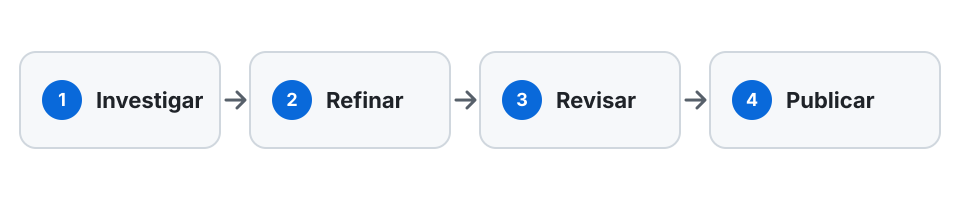
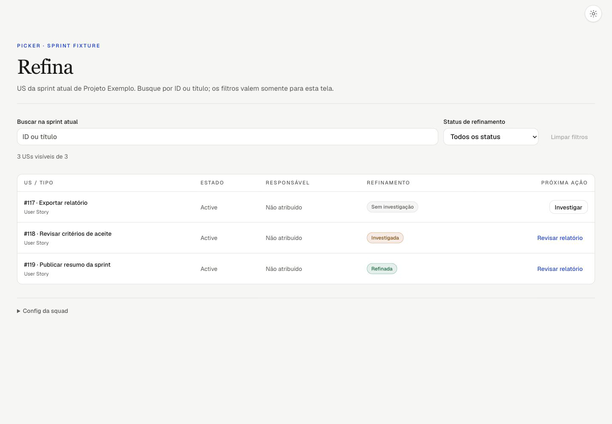
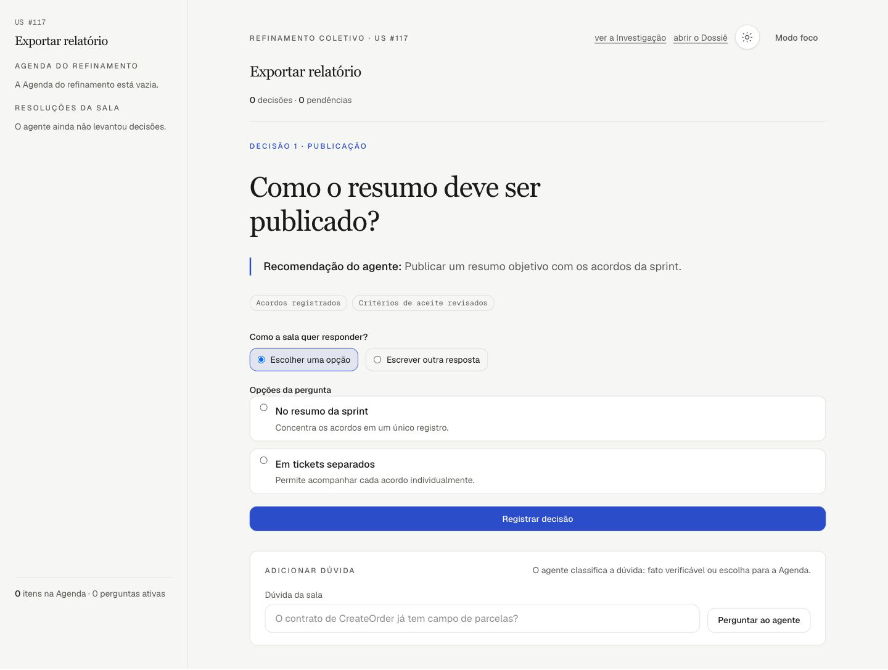
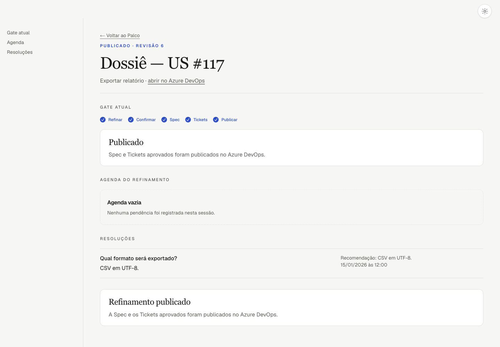

# Refina

[](LICENSE)


Refina transforma User Stories cruas em decisões explícitas, uma Spec revisável e Tickets prontos para publicação no Azure DevOps.

## Por que existe

User Stories costumam chegar cruas ao refinamento, e dependências importantes aparecem tarde, quando a sala já está tentando decidir. O Refina antecipa a investigação do código, conduz uma decisão por vez e mantém o que foi aprovado rastreável até a publicação.

## Como funciona



*Da investigação da User Story à publicação dos artefatos aprovados.*

## O produto em três momentos

### Picker

O Picker reúne as User Stories da sprint e deixa visível o estado de refinamento de cada uma.



*A sprint em uma tela: o que ainda precisa ser investigado e o que já avançou no fluxo.*

### Palco

O Palco conduz o refinamento coletivo com uma pergunta ativa, recomendação, evidências e opções para a sala.



*Uma decisão por vez, com contexto suficiente para a sala responder.*

### Dossiê

O Dossiê concentra os gates, a Agenda, as resoluções e o estado de publicação dos artefatos aprovados.



*A prova revisável do que foi decidido antes de publicar Spec e Tickets.*

## Visão técnica

Ferramenta de refinamento da squad: **Investigação** antes da sala e um fluxo persistente de **Refinar → Revisar Spec → Revisar Tickets → Publicar** no Azure DevOps.

Roda na máquina do **Operador**, em processo único. O Azure DevOps é a fonte da verdade ([ADR 0003](docs/adr/0003-azure-devops-como-fonte-da-verdade.md)); glossário do domínio em [CONTEXT.md](CONTEXT.md), spec do MVP em [`.scratch/mvp-spec/spec.md`](.scratch/mvp-spec/spec.md).

## Setup

Requer Node 22+ e pnpm 11+.

```bash
pnpm install

# 1. Config da squad: repos locais + organização/projeto do ADO.
cp sprint-griller.config.example.json sprint-griller.config.json
$EDITOR sprint-griller.config.json

# 2. Credencial do ADO (segredo — nunca vai para o arquivo de config).
cp apps/web/.env.example apps/web/.env
$EDITOR apps/web/.env

pnpm dev
```

Os repos são definidos **uma vez**, aqui — nenhuma cerimônia começa escolhendo repositório. Config inválida derruba o app na inicialização com a mensagem apontando o campo.

O caminho do arquivo de config pode ser trocado com `SPRINT_GRILLER_CONFIG`.

## Comandos

| Comando | O que faz |
|---|---|
| `pnpm dev` | Sobe o app em <http://localhost:3000> |
| `pnpm rolagem` | Trio anti-vaidade por sprint das últimas 6 sprints (ver abaixo) |
| `pnpm check` | Typecheck + lint + testes — o comando único do CI |
| `pnpm test` | Só os testes (vitest) |
| `pnpm build` / `pnpm start` | Build e execução em modo produção |

## Estrutura

```
apps/web                  app Next.js (App Router): picker, UI de sessão e rotas
packages/core             config da squad (zod) e logging estruturado
packages/ado-client       fronteira do Azure DevOps (REST tipado com zod) + script de rolagem
packages/agent-runtime    cliente do `codex app-server` (streaming, HITL, resume)
packages/investigation    turno da Investigação + checagem de grounding + Markdown
packages/ceremony         Refinamento coletivo + persistência (SQLite) + Palco e Dossiê
docs/adr                  decisões de arquitetura difíceis de reverter
```

As duas fronteiras onde vivem os logs estruturados e os testes de comportamento são `ado-client` e `agent-runtime`.

### Rodar o agente

O `agent-runtime` fala com o `codex app-server` usando o login ChatGPT do Operador ([ADR 0001](docs/adr/0001-codex-app-server-como-runtime.md)). Requer o Codex CLI no PATH e `codex login`.

```bash
pnpm --filter @sprint-griller/agent-runtime harness "investigue o cache de sessão"
pnpm --filter @sprint-griller/agent-runtime harness --resume <sessionId> "e o que ficou pendente?"
```

O harness mostra o turno streamando, pergunta no terminal quando o agente pede input, e imprime o id da sessão para retomar depois.

## Status de refinamento no picker

A tela inicial lista as US da iteration atual e mostra em que ponto do fluxo cada uma está — **sem Investigação**, **investigada** ou **refinada**. Não existe banco de status: o `ado-client` procura marcadores HTML que a própria ferramenta embute nos artefatos que grava no Azure DevOps.

| Marcador | Artefato que o carrega | Status resultante |
|---|---|---|
| `<!-- sprint-griller:investigacao -->` | Investigação publicada como comment na US | investigada |
| `<!-- sprint-griller:dump:<dumpId>:complete -->` | Prova final gravada na description após todo o despejo terminar | refinada |

Quem publica a Investigação precisa embutir `INVESTIGATION_MARKER`. O despejo só
pode chamar `publishDumpCompletion` depois de Spec, Tasks, estimativa, Registros
existirem no ADO. `SPEC_MARKER` identifica o bloco gerenciado da Spec, mas
sozinho não torna a US refinada.

## Investigação

**Investigar** no picker dispara um turno de agente e devolve a tela na hora: a
Investigação roda **AFK**, no processo do Operador, e o preview espera em
`/investigacao/<id da US>`. O agente lê a US no Azure DevOps e os repos do config
(o principal como `cwd`, os relacionados por caminho absoluto), e devolve um
relatório **estruturado** — o Markdown é renderizado por código, não pelo modelo
([ADR 0002](docs/adr/0002-escrita-no-ado-e-deterministica.md)).

Antes de valer alguma coisa, o relatório passa por uma **checagem mecânica de
citações** (`verifyGrounding`), sem LLM nenhum no caminho:

| Citação | Resultado |
|---|---|
| arquivo existe no repo citado | ok |
| `symbol` aparece no arquivo | ok |
| caminho não existe, aponta para fora do repo, ou não dá para ler | relatório **reprovado** |
| repo que não está na config da squad | relatório **reprovado** |

Reprovado é relatório que não publica: o preview mostra o que o agente disse com
o aviso de que não passou, e o próprio Markdown abre com o veredito e as citações
que falharam — o arquivo circula sozinho, não pode se apresentar como verificado.
O que o agente não conseguiu ancorar em código sai em **Não verificado**, e
suspeita de impacto em repo fora do config sai em **Impacto suspeito fora do
config** — nenhum dos dois entra no corpo como fato.

O turno roda em sandbox read-only, e não há humano na sala: todo pedido de
aprovação é recusado (é sempre um pedido para sair do sandbox — leitura dentro
dele não pergunta). Se o agente fizer uma pergunta, a resposta é que ninguém está
na tela, e a dúvida volta como furo da US.

> As Investigações vivem na memória do processo: reiniciar o app perde os
> previews que ainda não foram publicados no ADO.

### Publicar no Azure DevOps

O preview de uma Investigação **aprovada** tem um botão que grava o relatório
como comment Markdown na própria US — e é a única escrita no ADO que existe
hoje. Nada sai sozinho: a publicação é um clique do Operador, e quem grava é o
`ado-client`, nunca uma tool-call do modelo ([ADR 0002](docs/adr/0002-escrita-no-ado-e-deterministica.md)).

O comment carrega o `INVESTIGATION_MARKER`, então o picker passa a mostrar a US
como **investigada** na recarga seguinte — sem status guardado em lugar nenhum.

Toda escrita sai no log estruturado em `info`, com a URL da US e o tamanho do
corpo — sem copiar o relatório para o log. Quando ela falha, a mensagem diz se o
Operador precisa conferir a US antes de tentar de
novo: `HTTP 4xx` garante que nada foi gravado, mas `5xx`, conexão que cai no meio
ou resposta fora do contrato podem ter deixado o comment lá — republicar às cegas
é o que produz comment duplicado na US.

> O PAT precisa do escopo **Work Items (leitura e escrita)** para publicar a
> Spec, as Tasks, a estimativa e os Registros de decisão na própria US.

## Trio anti-vaidade por sprint

O comando da retro reúne três sinais: **taxa de rolagem** (% de US que entram
numa sprint e não concluem nela), **cobertura de refinamento** e **dúvidas
abertas no despejo** por US. Rola fora da UI e só lê o Azure DevOps:

```bash
pnpm rolagem              # últimas 6 sprints encerradas
pnpm rolagem --sprints 10
pnpm rolagem --before 2026-02-01  # baseline anterior ao rollout
```

A tabela sai no stdout (colável na retro) e o log estruturado no stderr. A
rolagem vem de WIQL cru; cobertura só recebe crédito quando a Investigação e a
auditoria imutável do gate foram gravadas no ADO até o fechamento da sprint.
US rolada com duas ou mais dúvidas abertas ganha o destaque diagnóstico.

O despejo grava a auditoria como comment invisível (`<!--
sprint-griller:dump:<id>:audit:pending:<n> -->`), com o número de pendências
que o gate mostrou. É o único estado adicional usado pelo relatório; comentários
posteriores não reescrevem a história de uma sprint encerrada.

Interpretação anti-vaidade, impressa no relatório: rolagem caindo + cobertura
alta = funciona; rolagem caindo + cobertura baixa = outra causa; rolagem
estável + cobertura alta = tese falhou.

Como a conta é feita, para quem for conferir o número na retro:

| Pergunta | Resposta do script |
|---|---|
| quais sprints entram | as últimas ~6 **encerradas** do time; use `--before AAAA-MM-DD` para fixar a baseline anterior a um rollout |
| quem entrou na sprint | união de dois snapshots WIQL `ASOF`: quem estava sob o path da sprint na **abertura** e no **fechamento** |
| quando a sprint fecha | no **fim** do último dia — o `finishDate` do ADO é a meia-noite que o abre, e parar ali jogaria fora o dia em que a squad mais fecha US |
| quem concluiu | estado no fechamento na categoria `Completed` do processo (`Closed` no Agile, `Done` no Scrum) |
| quem rolou | escopo menos concluídas — inclusive quem ficou em `Resolved` ou saiu da sprint antes do fim |
| e as removidas | US em categoria `Removed` saem do denominador: cancelamento não é rolagem |

Os dois snapshots existem porque nenhum sozinho basta: só a abertura perderia as
US puxadas no meio da sprint, e só o fechamento perderia as que saíram antes do
fim — que são exatamente as que rolaram. O que eles ainda não veem, e é bom
saber antes de defender o número na retro:

- US **puxada e retirada dentro da mesma sprint** não aparece em nenhum dos dois
  snapshots (subestima a rolagem);
- o fechamento é meia-noite **UTC**, então US concluída depois das 21h do último
  dia (horário de Brasília) conta como rolada (superestima);
- estado que o processo do ADO não declara mais cai em "rolou" — quando
  acontece, sai um `warn` no stderr com o nome do estado.

> Os números são sempre **agregados por sprint**: o script nunca pede ao Azure
> DevOps de quem é a US. A baseline existe para a squad julgar o processo, não
> para o processo julgar a squad. Nada aqui escreve no tracker.

## Refinamento coletivo: Palco e Dossiê

Com a Investigação aprovada, **Refinar com a sala** abre o Palco
(`/cerimonia/<id da sessão>`). O estado persistido segue as fases `Refinar`,
`Revisar Spec`, `Revisar Tickets`, `Publicar` e `Publicado`; um simples fim de
turno do agente nunca conclui a sessão.

A **Agenda do refinamento** nasce dos furos da Investigação. Cada item fica
aberto, em pesquisa, aguardando a sala, resolvido por fato ou escolha, ou
justificado como fora de escopo. Apenas uma pergunta da sala fica ativa por vez.
Quando a Agenda está vazia, o agente apresenta uma proposta de conclusão e a
sala escolhe entre confirmar ou continuar o Refinamento.

### Adicionar dúvida

Uma dúvida adicionada no Palco roda numa sessão auxiliar. O agente a classifica:

- fato verificável: volta com citações conferidas mecanicamente;
- escolha da sala: entra na Agenda com recomendação;
- resposta sem lastro: aparece marcada como não verificada;
- falha: permanece explícita e pode ser retomada.

Resoluções preservam pergunta, resposta, recomendação e horário. Não existe
autoria individual: a sala confirma os gates coletivamente.

### Revisar e publicar

O **Dossiê** (`/cerimonia/<id da sessão>/dossie`) separa os gates de revisão. A
Spec estruturada contém Problema, Solução, Comportamentos esperados, Decisões de
implementação, Estratégia de testes, Fora de escopo e Rastreabilidade. Depois da
aprovação da Spec, o agente submete Tickets como slices verticais com critérios
de aceite e dependências acíclicas.

As aprovações são versionadas. Reabrir o Refinamento preserva os rascunhos, mas
invalida aprovações derivadas. A publicação recebe do browser somente o id da
sessão e a estimativa; Spec e Tickets aprovados são carregados e revalidados no
SQLite antes de qualquer escrita no Azure DevOps. Retries continuam
idempotentes pelos marcadores `sprint-griller:*`.

O banco local é descartável. Mudanças incompatíveis sobem `SCHEMA_VERSION`, e
uma versão antiga é recusada com a orientação de apagar o arquivo.

## Licença

Distribuído sob a [licença MIT](LICENSE).
